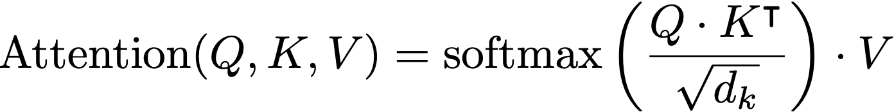
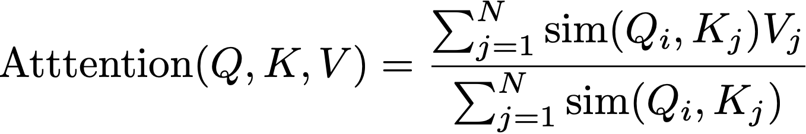
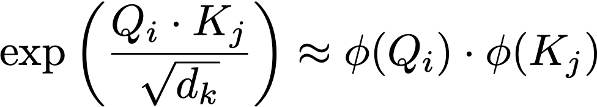
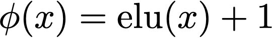
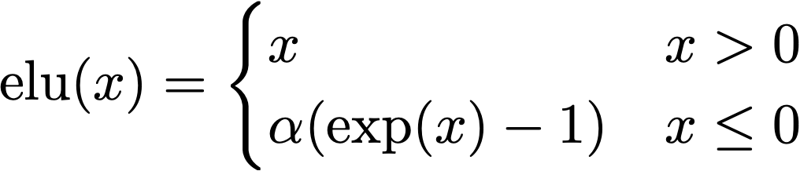
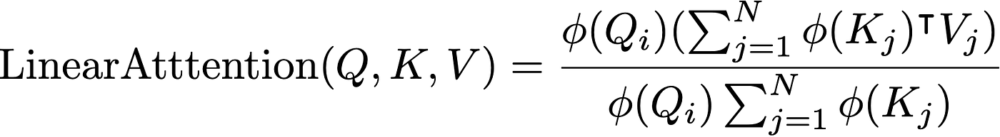
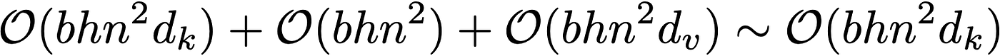
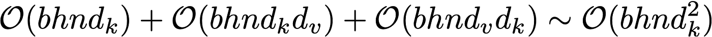
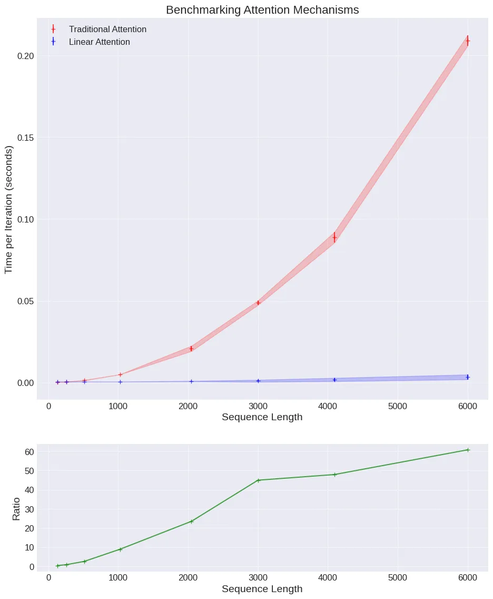

# Linear Attention

## Overview

An approximate algorithm that reduces the time complexity of the attention function from quadratic to linear.

## Assumption

The sequence length of the input token is much larger than the token dimension.

## Observation

- Dot product: Express the token similarity so it can be replaced by other similarity functions.
- Softmax: Express the probability distribution relating tokens to each other.

### Traditional Attention

${\text{Attention}(Q, K, V) = \text{softmax}(\frac{Q \cdot K^\intercal}{\sqrt{d_k}}) \cdot V}$
<!--  -->

### Traditional Attention with Similarity Function Variants

${\text{Attention}(Q, K, V) = \frac{\sum_{j=1}^N \text{sim}(Q_i, K_j) V_j}{\sum_{j=1}^N \text{sim}(Q_i, K_j)}}$
<!--  -->

## Algorithm

Linear Attention approximates the similarity function with ${\text{elu}(x) + 1}$, which allows computing the matrix multiplication between ${K}$ and ${V}$ (which takes ${n \cdot d_k \cdot d_v}$ time) before the matrix multiplication between ${Q}$ and ${K}$ (which takes ${n^2 \cdot d_k}$ time).

### Approximation



### Feature Map




### Linear Attention Algorithm



### Time Complexity: Traditional Attention



### Time Complexity: Linear Attention



## Implementation

```python
class LinearAttention(nn.Module):
    def __init__(self):
        super(LinearAttention, self).__init__()
        self.eps = 1e-6

    def elu_feature_map(self, x):
        return F.elu(x) + 1

    def forward(self, Q, K, V):
        Q = self.elu_feature_map(Q)
        K = self.elu_feature_map(K)
        KV = torch.einsum("nsd,nsd->ns", K, V)
        # Compute the normalizer
        Z = 1/(torch.einsum("nld,nd->nl", Q, K.sum(dim=1))+self.eps)
        # Finally compute and return the new values
        V = torch.einsum("nld,ns,nl->nd", Q, KV, Z)
        return V.contiguous()
```

## Accuracy

## Benchmark



## Reference

- [Linear Attention Is All You Need](https://towardsdatascience.com/linear-attention-is-all-you-need-5fa9c845c1b5)
